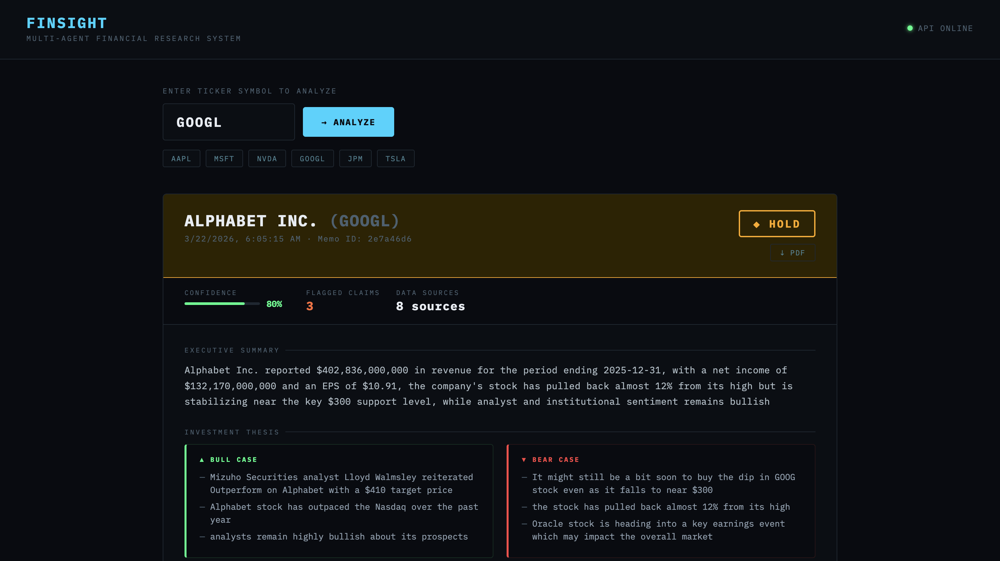
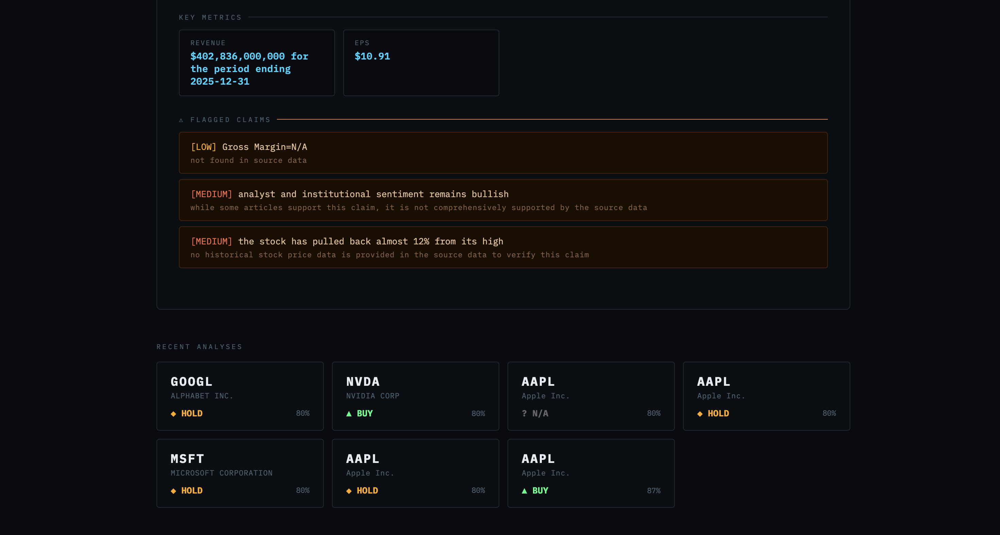

# FinSight
### Multi-Agent Financial Research System

<p align="center">
  
  
  
  
  
  
  
  
</p>

<p align="center">
  <a href="https://github.com/djism/finsight/actions/workflows/ci.yml">
    
  </a>
</p>

---

> **Type a ticker. Three AI agents go to work. Get a production-grade investment memo in 30 seconds — grounded in real SEC filings, fact-checked, confidence-scored, and downloadable as PDF.**

---

## The Demo



*Alphabet Inc. (GOOGL) — $402B revenue, EPS $10.91, HOLD recommendation, 80% confidence, 3 flagged claims — all sourced from live SEC EDGAR data and real news.*



*Recent analyses grid — GOOGL, NVDA, AAPL, MSFT analyzed back to back. Every ticker stored in PostgreSQL with pgvector.*

---

## Why This Exists

Most RAG systems ask a question and get an answer. That's one agent, one tool, one step.

FinSight does something fundamentally different — it simulates **how an investment bank actually works**: a researcher pulls data, an analyst writes the memo, a senior reviewer fact-checks it before it reaches the portfolio manager.

Three specialized agents. Each with a distinct role. Each checking the other's work.

The result isn't a chatbot response. It's a structured investment research memo — the same artifact a human analyst would spend hours producing.

---

## The 3-Agent Pipeline

```
┌──────────────────────────────────────────────────────────────┐
│                    You type: "NVDA"                          │
└──────────────────────────┬───────────────────────────────────┘
                           │
                           ▼
┌──────────────────────────────────────────────────────────────┐
│  AGENT 1 — FETCHER                                           │
│                                                              │
│  • Hits SEC EDGAR API → fetches 10-K and 10-Q filings        │
│  • Extracts structured XBRL financial data (revenue, EPS)    │
│  • Pulls 5 recent news articles from NewsAPI                 │
│  • Caches everything in PostgreSQL                           │
│                                                              │
│  Output: Raw data package handed to Analyst                  │
└──────────────────────────┬───────────────────────────────────┘
                           │
                           ▼
┌──────────────────────────────────────────────────────────────┐
│  AGENT 2 — ANALYST                                           │
│                                                              │
│  • Reads all raw data from Fetcher                           │
│  • Calls Groq (Llama 3.3 70B) with structured JSON prompt    │
│  • Extracts financial metrics: revenue, EPS, margins, FCF    │
│  • Writes investment narrative: summary, bull case, bear case│
│  • Issues recommendation: BUY / HOLD / SELL                  │
│                                                              │
│  Output: Structured AnalystOutput → Pydantic validated       │
└──────────────────────────┬───────────────────────────────────┘
                           │
                           ▼
┌──────────────────────────────────────────────────────────────┐
│  AGENT 3 — CRITIC                                            │
│                                                              │
│  • Reads the Analyst's memo + original source data           │
│  • Cross-checks every claim against what was actually in     │
│    the SEC filings and news                                  │
│  • Flags contradicted or unsupported claims with severity    │
│  • Assigns a confidence score: 0.0 (hallucinated) → 1.0      │
│                                                              │
│  Output: CriticOutput with confidence score + flagged claims │
└──────────────────────────┬───────────────────────────────────┘
                           │
                           ▼
┌──────────────────────────────────────────────────────────────┐
│  ASSEMBLY                                                    │
│  • Analyst + Critic merged into InvestmentMemoSchema         │
│  • Saved to PostgreSQL with pgvector embedding               │
│  • Returned as JSON to React frontend                        │
│  • Available as downloadable PDF                             │
└──────────────────────────────────────────────────────────────┘
```

---

## What Makes This Different

### 1. Real Data — Not Mocked, Not Scraped

Every financial fact comes directly from **SEC EDGAR's XBRL API** — the same structured data feed used by Bloomberg and institutional investors. Revenue figures, EPS, filing dates — all pulled live, no scraping, no hallucination.

```python
# Real Apple revenue from SEC EDGAR XBRL — no LLM involved
Revenue: $416,161,000,000 (period ending 2025-09-27)
EPS:     $7.49
```

### 2. The Critic Agent — Built-in Hallucination Detection

This is the architectural decision that separates FinSight from a basic LLM wrapper. The Critic agent reads the Analyst's memo and the original source data **simultaneously** — then flags every claim it can't verify.

```
[LOW]    Gross Margin=N/A
         → not found in source data

[MEDIUM] analyst and institutional sentiment remains bullish
         → while some articles support this, not comprehensively supported

[MEDIUM] the stock has pulled back almost 12% from its high
         → no historical stock price data provided to verify this claim
```

This is **structural hallucination detection** at the agent level — not a post-hoc check, but a dedicated review step baked into the pipeline architecture.

### 3. Structured Output — Pydantic All The Way Down

Every piece of data flowing between agents is a validated Pydantic model. The LLM cannot return malformed output without the pipeline catching and handling it.

```python
class InvestmentMemoSchema(BaseModel):
    ticker: str
    recommendation: Recommendation          # enum: BUY | HOLD | SELL
    confidence_score: float                 # ge=0.0, le=1.0
    metrics: FinancialMetrics               # typed financial data
    flagged_claims: list[RiskFlag]          # critic's findings
    sources: DataSources                    # full audit trail
```

### 4. PostgreSQL + pgvector — Not Just Storage

Every memo is stored with a vector embedding of its summary. This enables **semantic search over past analyses** — find similar companies, track how recommendations change over time, build portfolio-level intelligence.

---

## Architecture

```
finsight/
├── backend/
│   ├── agents/
│   │   ├── fetcher_agent.py    # Agent 1 — data collection
│   │   ├── analyst_agent.py    # Agent 2 — memo generation
│   │   ├── critic_agent.py     # Agent 3 — fact-checking
│   │   └── crew.py             # Orchestrator — runs full pipeline
│   ├── tools/
│   │   ├── edgar_tool.py       # SEC EDGAR + XBRL API
│   │   └── news_tool.py        # NewsAPI integration
│   ├── db/
│   │   ├── database.py         # PostgreSQL + pgvector setup
│   │   ├── models.py           # SQLAlchemy ORM models
│   │   └── memo_store.py       # CRUD operations
│   ├── schemas/
│   │   └── memo.py             # Pydantic models (FetcherOutput,
│   │                           # AnalystOutput, CriticOutput,
│   │                           # InvestmentMemoSchema)
│   ├── output/
│   │   └── pdf_generator.py    # ReportLab PDF generation
│   └── api/
│       ├── main.py             # FastAPI app + lifespan
│       ├── routes.py           # /analyze /memo /memos /pdf
│       └── schemas.py          # API request/response models
├── frontend/
│   └── src/
│       └── App.jsx             # React — single file, zero deps
├── tests/
│   └── test_agents.py          # 11 unit tests
├── docker-compose.yml          # PostgreSQL + backend + frontend
├── Dockerfile.backend
└── Dockerfile.frontend
```

---

## Tech Stack

| Layer | Technology | Why |
|---|---|---|
| **Agent Orchestration** | LangGraph | Stateful agent graphs with conditional edges |
| **LLM** | Llama 3.3 70B via Groq | Free, fast, production-quality inference |
| **Financial Data** | SEC EDGAR XBRL API | Structured, authoritative, real-time |
| **News** | NewsAPI | Live company news for sentiment context |
| **Database** | PostgreSQL + pgvector | Relational storage + vector search on memos |
| **ORM** | SQLAlchemy | Type-safe database interactions |
| **Validation** | Pydantic v2 | Agent-to-agent data contracts |
| **PDF** | ReportLab | Professional investment memo generation |
| **Backend API** | FastAPI + Uvicorn | Async, typed, auto-documented |
| **Frontend** | React + Vite | Terminal-aesthetic dark UI |
| **Containerization** | Docker + docker-compose | One command to run everything |
| **CI/CD** | GitHub Actions | 11 unit tests + Docker build on every push |

**Total cost to run: $0** — Groq free tier, SEC EDGAR is free, open source everything.

---

## Getting Started

### Prerequisites
- Python 3.11+
- Node.js 20+
- Docker Desktop
- PostgreSQL 15 with pgvector
- [Groq API key](https://console.groq.com) (free)
- [NewsAPI key](https://newsapi.org) (free)

### 1. Clone and setup

```bash
git clone https://github.com/djism/finsight.git
cd finsight

python -m venv finsight-env
source finsight-env/bin/activate
pip install -r requirements.txt
```

### 2. Configure environment

```bash
cp .env.example .env
# Add your GROQ_API_KEY and NEWS_API_KEY
```

### 3. Setup database

```bash
# Start PostgreSQL
brew services start postgresql@15

# Create database and enable pgvector
psql postgres -c "CREATE DATABASE finsight;"
psql finsight -c "CREATE EXTENSION IF NOT EXISTS vector;"

# Create tables
python backend/db/models.py
```

### 4. Run with Docker (recommended)

```bash
docker-compose up --build
```

| Service | URL |
|---|---|
| React Frontend | http://localhost:5173 |
| FastAPI Backend | http://localhost:8000 |
| Swagger Docs | http://localhost:8000/docs |

### 5. Or run locally

```bash
# Terminal 1 — Backend
python backend/api/main.py

# Terminal 2 — Frontend
cd frontend && npm run dev
```

---

## API Reference

### `POST /api/v1/analyze`

Runs the full 3-agent pipeline for a ticker.

```bash
curl -X POST http://localhost:8000/api/v1/analyze \
  -H "Content-Type: application/json" \
  -d '{"ticker": "NVDA"}'
```

```json
{
  "success": true,
  "ticker": "NVDA",
  "company_name": "NVIDIA Corp",
  "recommendation": "BUY",
  "confidence_score": 0.82,
  "summary": "NVIDIA reported revenue of $130.5 billion...",
  "bull_case": "AI chip dominance | Data center growth | Strong margins",
  "bear_case": "Valuation premium | Export restrictions | Competition",
  "metrics": {
    "revenue": "$130,497,000,000",
    "eps": "$2.94",
    "guidance": "Q1 FY2026 revenue ~$43B"
  },
  "flagged_claims": [
    {
      "claim": "dominant position in AI chip market",
      "reason": "not directly quantified in provided source data",
      "severity": "LOW"
    }
  ],
  "created_at": "2026-03-22T06:05:15"
}
```

### `GET /api/v1/memo/{ticker}`

Returns the most recent cached memo — no re-analysis.

### `GET /api/v1/memo/{ticker}/pdf`

Downloads a professionally formatted PDF investment memo.

### `GET /api/v1/memos`

Returns history of all analyzed tickers.

---

## Test Results

```
tests/test_agents.py::test_config_imports                  PASSED
tests/test_agents.py::test_schemas_recommendation_enum     PASSED
tests/test_agents.py::test_schemas_risk_level_enum         PASSED
tests/test_agents.py::test_financial_metrics_schema        PASSED
tests/test_agents.py::test_investment_memo_schema          PASSED
tests/test_agents.py::test_memo_to_db_dict                 PASSED
tests/test_agents.py::test_api_schemas                     PASSED
tests/test_agents.py::test_api_request_uppercase           PASSED
tests/test_agents.py::test_memo_markdown                   PASSED
tests/test_agents.py::test_db_connection                   PASSED
tests/test_agents.py::test_memo_store_save_and_retrieve    PASSED

11 passed in 0.73s
```

---

## The Design Decisions Worth Talking About

**Why 3 separate agents instead of 1?**
Because one agent doing everything has no accountability. The Analyst is optimized to write compelling memos — it will speculate. The Critic is optimized to find holes — it will challenge. These goals are in tension, and that tension produces better outputs than a single agent trying to do both.

**Why structured JSON output with Pydantic instead of free text?**
Because free text from an LLM can't be stored in a database, displayed in a consistent UI, or compared across tickers. Every output that flows between agents is a typed contract. If the LLM returns malformed JSON, the pipeline catches it, cleans it, and recovers — it never crashes.

**Why SEC EDGAR XBRL instead of scraping?**
Because the EDGAR XBRL API gives you structured financial data tagged to standard accounting concepts — the same data the SEC mandates public companies file. It's authoritative, free, and doesn't require scraping HTML. Revenue is `us-gaap/Revenues`, not a regex on a PDF.

**Why PostgreSQL with pgvector?**
Because memos should be searchable, not just retrievable. Storing vector embeddings of memo summaries enables semantic similarity search — "find me companies with similar financial profiles to NVDA" is a future query this schema already supports.

---

## What This Showcases

This project demonstrates the full production AI engineering stack in one codebase — multi-agent orchestration with LangGraph, structured LLM output with Pydantic, hallucination detection at the architecture level, real external API integration (SEC EDGAR, NewsAPI), relational + vector database design, PDF generation, React frontend, containerization, and CI/CD. Every layer was built to production standards, not notebook standards.

---

## Author

**Dhananjay Sharma**
M.S. Data Science, SUNY Stony Brook (May 2026)

<p>
  <a href="https://www.linkedin.com/in/dsharma2496/">LinkedIn</a> ·
  <a href="https://djism.github.io/">Portfolio</a> ·
  <a href="https://github.com/djism">GitHub</a>
</p>

---

<p align="center">
  <i>Type a ticker. Three agents go to work.</i>
</p>